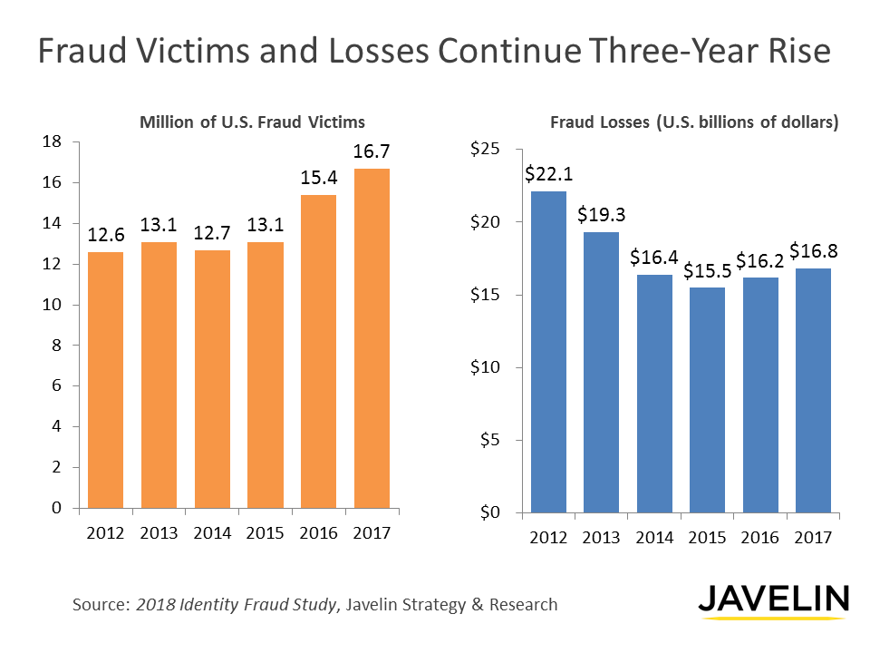
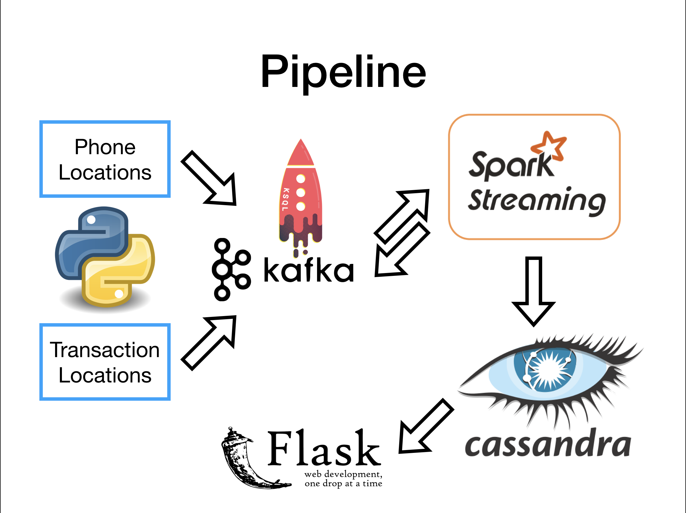
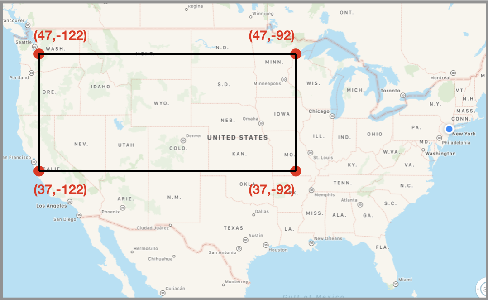

# Proximity Alert
Proximity alert is a real-time credit card fraud detection system based on phone and transaction location data

This a project that was developed at the 2018 summer session of an fellowship at Insight Data Science.

## Business Motivation
### Credit Card Fraud
Credit card fraud has been a problem for both customers and banks since its the widespread acceptance of using cards in 1950. Despite this problem existing for 70 years its occurrence has only become more pervasive resulting in $17 billion worth of damages while effecting 16.7 million consumers, up 7%  from 2016. Steps have been taken to thwart these thieves by implementing a more secure form of card transaction with the advent of EMV "chip" technology but this has pushed fraudsters to online channels. Now "Card Not Present Fraud" is 81% more likely than its in person point of sale fraud. 

Credit information being stolen is become more pervasive in our technology based society and our institutions are struggling to keep up. Recent breaches of customer information effected 30% of US consumers in 2017 and are causing the public to lose faith in these institutions' ability to keep their data safe.

### Fraud Detection System
As credit card fraud is becoming increasing more common, it is important to recognize when a costumer's account has been compromised to mitigate any further damages.

**Proximity Alert** harnesses user location data along with transaction location data to make informed decisions on if any given transaction is actually being made by the customer. Effectively using the customer's location as an additional means of transaction authentication.

If a transaction is flagged as being potentially/ fraudulent, actions could be taken to prevent possible damages to the user's account.

## Pipeline

This pipeline was hosted on Amazon AWS EC2 m4.large running Ubuntu. The initial set up was handled by Insigiht's custom EC2 manager [Pegasus](https://github.com/InsightDataScience/pegasus).

### Data Generation

I was unable to gain access to real phone and transaction location data for this project so I wrote a Python script to generate realistic GPS locations.

Locations were sampled from an approximate rectangle on the United States mainland. This was done to ensure that all GPS locations were located on land and not in the middle of the ocean.

The script would initialize random latitude and longitude locations for the number of customers desired along with a timestamp to mimic when the location was received. A new phone locations would be generated every minute by sampling from new coordinates from the customer's previous latitude and longitude positions.

These values would be generated in real-time and then produced into Kafka where it would be consumed and ingested into the pipeline.

### Tools
#### Kafka
Version: 1.0.0

Kafka was used to process both streams of phone locations and transaction locations. Both were produced separately and became distinct Kafka topics. Kafka also alowed for the usage of KSQL which was important for real-time joins of the two streams.

#### KSQL

Version: [4.1.1-post](https://github.com/confluentinc/ksql/tree/4.1.1-post)

KSQL is very new only having been released at the end of 2017. It offers the ability to execute continuous queries on topics, even extending to joins, and then produce it into a new topic that can be consumed. It runs on the Kafka Streams API but allows users to write commands using familiar SQL commands.

In this pipeline, KSQL was used to combine the two phone and transaction locations data streams and produce one topic that would contain both phone and transaction data grouped by each user.

#### Spark Streaming

Version: 2.2.1

* PySpark 2.3.1

Spark efficiently calculated the proximity of the two locations and then filter only those distances that might be concern for possible fraud. The simple metric that was used was any distance exceeding 1.25 miles would be reason to flag a transaction for possible fraud but in the future a more robust metric would need to be developed.

These flagged transactions were then sent to a Cassandra table where they would accumulate.

#### Cassandra

Version: 3.11.1

Cassandra was chosen since this project needed a database that was able to handle quick writes and reads in real time. Its distributed nature also allows for replication of the data across multiple nodes in the event of failures.

#### Flask

Version: 1.0.2

Flask provided a front end visualization of the flagged transactions. It would query the flagged results from Cassandra and display them in a table. To see this look at the demo section

## Demo

Demo link: [Proximity Alert Live Demo](http://www.theproximityalert.com/table)

Demo video: [Proximity Alert Video Demo](https://www.youtube.com/watch?v=h77NCA6jjfY&feature=youtu.be)

